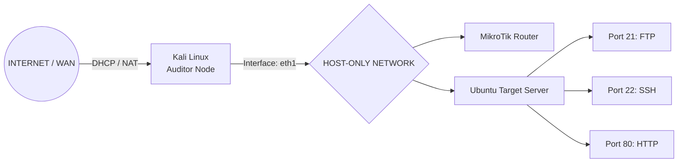

# 🛡️ Comprehensive Security Audit & Penetration Testing Report: v1.0.0

  
  
  

## 1. Project Overview
Laporan ini mendokumentasikan proses audit keamanan, simulasi eksploitasi, dan langkah penguatan (*hardening*) pada infrastruktur **PT. TechSecure Indonesia v1.0.0**. Audit ini dilakukan untuk memvalidasi konfigurasi jaringan, menguji kerentanan aplikasi web, dan memperkuat postur keamanan sistem.

## 2. Network Infrastructure Topology

---

  Maintained by <b>pagarkristian</b> for Enterprise Security Hardening & Defense Standardization.

