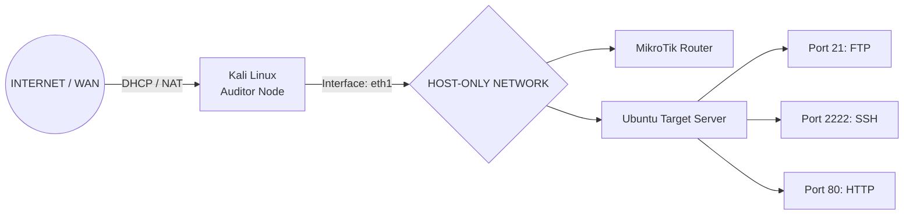

# 🛡️ Comprehensive Security Audit & Penetration Testing Report: v1.0.0

<p align="center">
  
  
  
</p>

## 1. Project Overview
This document details the complete technical writeup of the security auditing, post-hardening attack verification, and defensive engineering executed against the local staging infrastructure of **PT. TechSecure Indonesia v1.1.0**. 

The goal of this phase was to actively re-attack the target environment after implementing security defenses to empirically verify that all historical critical vectors are successfully mitigated.

## 2. Network Infrastructure Topology

---
## 3. Active Reconnaissance & Service Enumeration
### A. Pemindaian Port Agresif (Nmap)
Pemindaian port lengkap disertai dengan skrip aman default dan deteksi versi banner dimulai untuk melacak daemon yang berjalan pada host target ( 10.216.27.100):

```Bash
nmap -p- -sC -sV -A 10.216.27.100
```


# Reconnaissance Analysis:
The scan confirms that the standard SSH port (22) has been successfully obfuscated and migrated to port 2222 as a defensive measure to mitigate automated background scanning traffic sequences.

---

### B. Automated Web Directory Auditing
Gobuster extracted hidden paths across the web server application. The discovery phase mapped a restricted /javascript/ root directory which returned an explicit 403 Forbidden response status, indicating that indexing restrictions were cleanly applied.


---

## 3. Vulnerability Analysis (Pre-Hardening)
Initial reconnaissance and penetration testing identified the following critical security flaws:

* **SQL Injection**: Authentication bypass possible on the administrative login portal.
* **Unrestricted File Upload**: Remote Code Execution (RCE) vector via the document upload endpoint.
* **Weak Authentication**: SSH service susceptible to dictionary-based brute force attacks.
* **Insecure Permissions**: Web directory (/uploads) configured with world-writable (777) permissions.

## 4. Remediation & Hardening Report

Following the identification of critical vulnerabilities, the following security patches were successfully implemented:

| Vulnerability / Vector | Remediation Action | Security Patch / Control | Status |
| :--- | :--- | :--- | :--- |
| **SQL Injection** | Implemented Prepared Statements and parameterized inputs for all database queries. | Code Logic Patch (`index.php`) |  |
| **File Upload RCE** | Applied server-side whitelist validation for file extensions and disabled script engines. | Access Control List & `.htaccess` |  |
| **Brute Force (SSH)** | Configured Fail2Ban to monitor authentication logs and automatically ban malicious IPs. | Intrusion Prevention System |  |
| **Weak Permissions** | Restored directory permissions to mode `755` and reassigned ownership to `www-data`. | Filesystem Integrity |  |
| **Anonymous FTP Access** | Disabled unauthenticated logins (`anonymous_enable=NO`) and enforced local user authentication. | Service Hardening (`vsftpd.conf`) |  |


---

## 5. Retesting & Post-Hardening Attack Verification
An active verification cycle was launched from the Auditor Node (10.216.27.10) to re-attack the remediated controls. All subsequent exploitation chains failed completely, validating the effectiveness of our defenses.

###  A SQL Injection Re-Attack
The administrator login portal processed incoming parameter inputs using raw variable interpolation rather than parameter binding.


**Exploitation Method**: Injecting the previous authentication bypass string layout admin'# directly into the username credential field.


**Observed Result**: The input validation engine correctly bounds the characters as string literals. The dynamic SQL bypass injection logic is neutralized, access is denied, and the application safely drops the traffic sequence.
**Status: ✅ MITIGATED / SECURED**

---

### B. Arbitrary File Upload Re-Attack (RCE Verification)
**Exploitation Method**: Attempting to force-upload the weaponized PHP web shell payload (exploit.php) through the backend asset submission interface.

**Observed Result**: The strict server-side file extension matching algorithm parsed the file name, identified the illegal .php script suffix, halted the file write stream, and safely terminated the upload execution pipeline.


# System Security Enforcement Result:
The server backend successfully intercepted the anomalous traffic sequence and rejected the file upload, returning an explicit defensive error notification: "Gagal! Format file tidak diizinkan."

---

### C. SSH Brute-Force Re-Attack (Fail2Ban/IPS Verification)
**Exploitation Method**: Running a high-velocity dictionary password spraying sequence (Hydra) targeting the custom SSH daemon channel on Port 2222.


**Observed Result**: Fail2Ban's log filter immediately matched the failed authentication attempts inside /var/log/auth.log. Upon detecting the threshold breach of failed attempts, the daemon automatically triggered an Netfilter rule to inject the attacker's IP address (10.216.27.10) into the real-time drop blocklist.


---

### D. Anonymous FTP Access Re-Test
**Exploitation Method**: Attempting unauthenticated service enumeration using an anonymous login context session.


**Observed Result**: The target service dropped the sequence with an explicit 530 Login incorrect payload response. Anonymous service enumeration vectors are fully neutralized.

---

## E . Network Perimeter Defense (MikroTik RouterOS)
To shield the environment from external scanning and edge attacks, specific network filtering constraints were applied at the gateway router interface:


Input Chain Restrictions: Configured rules to automatically drop unauthorized input packets arriving from the WAN interface (ether1).

Forwarding Logic: Allowed explicitly safe traffic handling rules restricted strictly to port 2222 to preserve remote administrative accessibility.

---

## 6. Conclusion & Operational Status
The active post-hardening test lifecycle confirms that PT. TechSecure Indonesia v1.1.0 is fully secured against the primary attack vectors discovered in the initial audit. The combination of network edge firewall filtering, secure server-side verification logic, and automated host intrusion prevention effectively establishes a resilient defense-in-depth posture.


---
<div align="center">
  <sub>Maintained by <b>pagarkristian</b> for Cyber Security & Red Team Portfolio Standardization.</sub>
</div>
