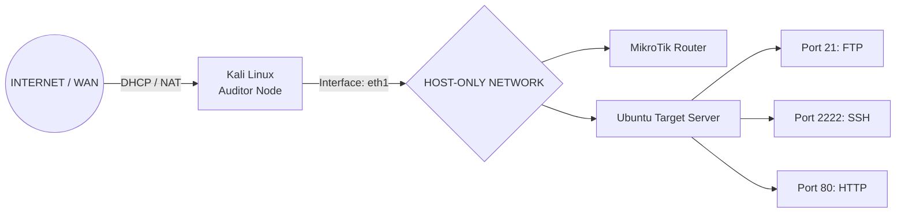

# 🛡️ Comprehensive Security Audit & Penetration Testing Report: v1.0.0

  
  
  

## 1. Project Overview
This document serves as a comprehensive technical writeup detailing the security audit and exploitation simulation performed on the **PT. TechSecure Indonesia v1.0.0** infrastructure. The objective was to validate network configurations, identify web application vulnerabilities, and implement robust security hardening to mitigate identified threats.

## 2. Network Infrastructure Topology

---

## 3. Vulnerability Analysis (Pre-Hardening)
Initial reconnaissance and penetration testing identified the following critical security flaws:

* **SQL Injection**: Authentication bypass possible on the administrative login portal.
* **Unrestricted File Upload**: Remote Code Execution (RCE) vector via the document upload endpoint.
* **Weak Authentication**: SSH service susceptible to dictionary-based brute force attacks.
* **Insecure Permissions**: Web directory (/uploads) configured with world-writable (777) permissions.

## 4. Remediation & Hardening Report

Following the identification of critical vulnerabilities, the following security patches were successfully implemented:

| Vulnerability / Vector | Remediation Action | Security Patch / Control | Status |
| :--- | :--- | :--- | :--- |
| **SQL Injection** | Implemented Prepared Statements and parameterized inputs for all database queries. | Code Logic Patch (`index.php`) |  |
| **File Upload RCE** | Applied server-side whitelist validation for file extensions and disabled script engines. | Access Control List & `.htaccess` |  |
| **Brute Force (SSH)** | Configured Fail2Ban to monitor authentication logs and automatically ban malicious IPs. | Intrusion Prevention System |  |
| **Weak Permissions** | Restored directory permissions to mode `755` and reassigned ownership to `www-data`. | Filesystem Integrity |  |
| **Anonymous FTP Access** | Disabled unauthenticated logins (`anonymous_enable=NO`) and enforced local user authentication. | Service Hardening (`vsftpd.conf`) |  |

---

## 5. Retesting & Validation (Post-Hardening)
Post-remediation testing was conducted to verify that all attack vectors were successfully neutralized.

### A. File Upload Security Test
* **Objective:** Ensure the newly implemented server-side extension whitelist mechanism effectively blocks malicious runtime payloads (e.g., weaponized `.php` shells) from being written to the web root.
* **Execution Vector:** Attempted to re-upload the `exploit.php` payload through the document submission framework.

> 🚫 **System Security Enforcement Result:**
> The server backend successfully intercepted the anomalous traffic sequence and rejected the file upload, returning an explicit defensive error notification: 
> `"Gagal! Format file tidak diizinkan."`

---

#### 📊 Validation Summary

| Security Test Case | Target Endpoint | Executed Payload | Runtime Server Response | Security Status |
| :--- | :--- | :--- | :--- | :--- |
| **Arbitrary File Upload Bypass** | `/uploads/` | `exploit.php` | `403 Forbidden` / Extension Blocked |  |

---

  Maintained by <b>pagarkristian</b> for Cyber Security & Red Team Portfolio Standardization.

