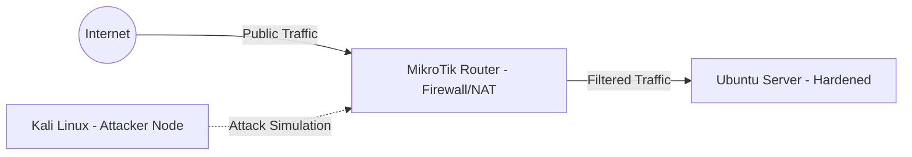

```mermaid
graph LR
    Internet((Internet)) -->|Public Traffic| MT[MikroTik Router - Firewall/NAT]
    MT -->|Filtered Traffic| UB[Ubuntu Server - Hardened]
    Kali[Kali Linux - Attacker Node] -.->|Attack Simulation| MT
```
