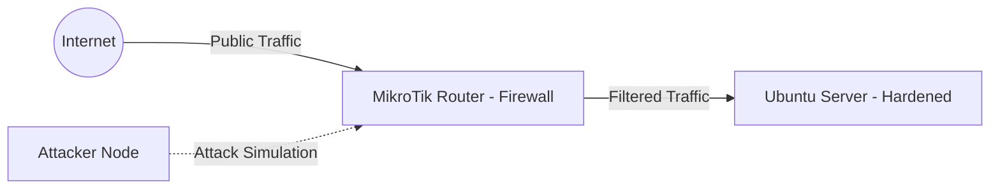

# 🛡️ Enterprise-Grade Hardening & Perimeter Defense: Project TechSecure

**Status:** 🔒 Fully Hardened & Secured | **Architecture:** Defense-in-Depth | **Version:** 1.1.0

## 1. Project Overview
This project documents the transformation of an infrastructure from a vulnerable baseline into a hardened, production-ready environment. We implement a **Defense-in-Depth** strategy by integrating **Network Perimeter Security (MikroTik)** and **OS/Application Hardening (Ubuntu)** to mitigate cyber threats.

---

## 2. Infrastructure Architecture
### 🏗️ Network Diagram

### 📋 Asset Inventory

| Asset | Role / Function | Operating System | IP Address | Active Open Ports | Security State |
| :--- | :--- | :--- | :--- | :--- | :--- |
| **Core-Gateway** | Edge Router / NAT | MikroTik RouterOS v7.21.4 | `10.216.27.1` | Port 8291 (Winbox) |  |
| **TechSecure-Portal** | Production Target Web | Ubuntu Server 24.04 LTS | `10.216.27.100` | Port 80 (HTTP), Port 21 (FTP), 2222 (SSH) |  |
