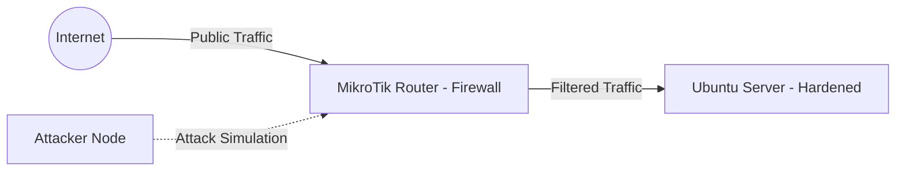

# 🛡️ Enterprise-Grade Hardening & Perimeter Defense: Project TechSecure

**Status:** 🔒 Fully Hardened & Secured | **Architecture:** Defense-in-Depth | **Version:** 1.1.0

## 1. Project Overview
This project documents the transformation of an infrastructure from a vulnerable baseline into a hardened, production-ready environment. We implement a **Defense-in-Depth** strategy by integrating **Network Perimeter Security (MikroTik)** and **OS/Application Hardening (Ubuntu)** to mitigate cyber threats.

---

## 2. Infrastructure Architecture
### 🏗️ Network Diagram

