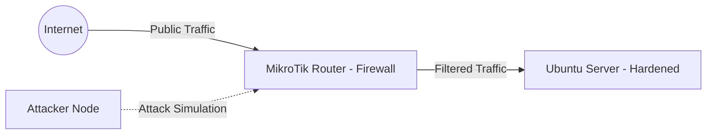

# 🛡️ Enterprise-Grade Hardening & Perimeter Defense: Project TechSecure

**Status:** 🔒 Fully Hardened & Secured | **Architecture:** Defense-in-Depth | **Version:** 1.1.0


## 1. Project Overview
This project documents the transformation of an infrastructure from a vulnerable baseline into a hardened, production-ready environment. We implement a **Defense-in-Depth** strategy by integrating **Network Perimeter Security (MikroTik)** and **OS/Application Hardening (Ubuntu)** to mitigate cyber threats.

---

## 2. Infrastructure Architecture
### 🏗️ Network Diagram

### 📋 Asset Inventory

| Asset | Role / Function | Operating System | IP Address | Active Open Ports | Security State |
| :--- | :--- | :--- | :--- | :--- | :--- |
| **Core-Gateway** | Edge Router / NAT | MikroTik RouterOS v7.21.4 | `10.216.27.1` | Port 8291 (Winbox) |  |
| **TechSecure-Portal** | Production Target Web | Ubuntu Server 24.04 LTS | `10.216.27.100` | Port 80 (HTTP), Port 21 (FTP), 2222 (SSH) |  |

---

# Disclaimer
Dont Forget To Backup Your Data Before Hardening 


---

## 3. Vulnerable Baseline (Phase 1)
Initial state configuration used for testing and exploitation development.

* **FTP Service:** Anonymous authentication access is left enabled (`Response Code 230`), allowing for unauthenticated remote credential harvesting.
* **Samba Shares:** Unauthenticated public share traversal misconfiguration is active, allowing external network enumeration of stored files.
* **Application Logic:** Dynamic input string execution uses direct parameter concatenation inside the SQL query backend:
  ```sql
  $query = "SELECT * FROM users WHERE user = '$user' AND password = '$pass'";
  ```
* **Permissions**: /uploads directory set to 777 allowing arbitrary file uploads.

---

## 4. Technical Hardening Procedures (Phase 2)
### A. Host-Based Firewall Enforcement (UFW)
Establish a network defense posture directly on the host operating system to restrict unapproved traffic channels while cleaning historical open ports.

```bash
# Configure default firewall behavior
sudo ufw default deny incoming
sudo ufw default allow outgoing

# Open required production services
sudo ufw allow 80/tcp
sudo ufw allow 21/tcp
sudo ufw allow 2222/tcp

# Remove legacy standard management ports to enforce isolation
sudo ufw delete allow 22/tcp

# Enable Firewall
sudo ufw enable
```


### B. SSH Cryptographic Hardening & Key Authentication
Disable weak password-based authentication and migrate operational channels to non-standard ports.

#### 1 Generate an Ed25519 cryptographic key-pair configuration:
```Bash
ssh-keygen
```


#### 2 Register and assign the host key signature directly within the user account profile boundary:
```bash
cat ~/.ssh/id_ed25519.pub >> ~/.ssh/authorized_keys
chmod 600 ~/.ssh/authorized_keys
```


#### 3 Modify the core daemon structure to enforce cryptographic requirements:
```Bash
sudo nano /etc/ssh/sshd_config
```


#### Enforce parameters within the SSH configuration file:
```Plaintext
Port 2222
PermitRootLogin no
PasswordAuthentication no
MaxAuthTries 3
```


```Bash
# Apply and validation connection routing parameters
sudo systemctl restart ssh
ssh -p 2222 ubuntu@10.216.27.100
```


### C. FTP Service Hardening Configuration
Secure local file transfer services and remove unauthenticated access vectors.
```Bash
# Modify vsftpd configuration file
sudo nano /etc/vsftpd.conf
```


#### Enforce secure parameters inside /etc/vsftpd.conf:
```Plaintext
anonymous_enable=NO
local_enable=YES
write_enable=YES
anon_root=/var/ftp
```


```Bash
# Commit modifications to the running service daemon
sudo systemctl restart vsftpd
```


### D. Database Security (SQLi Mitigation Via Prepared Statements)
Isolate database parsing operations from untrusted user inputs inside the web application core backend (/var/www/html/index.php).

```Bash
sudo nano /var/www/html/index.php
```


#### Implementation layout inside index.php:
```PHP
<?php
    // Query Hardening Execution
    $stmt = $conn->prepare("SELECT * FROM users WHERE username = ? AND password = ?");
    $stmt->bind_param("ss", $user, $pass); // "ss" denotes two string parameters
    $stmt->execute();
    $result = $stmt->get_result();

    if ($result->num_rows > 0) {
        header("Location: dashboard.php");
        exit();
    } else {
        echo "<p style='color: #ff4d4d; text-align: center;'>Login Failed!</p>";
    }
}
?>
```


### E. Filesystem Integrity & Access Control Lists
Lock down directory read/write privileges and disable runtime script parsing within publicly writable upload channels.
```Bash
# Reassign operational ownership to the runtime web application owner
sudo chown -R www-data:www-data /var/www/html/uploads/
sudo chmod -R 755 /var/www/html/uploads/

# Open and configure the Apache runtime override configuration file
sudo nano /var/www/html/uploads/.htaccess
```


### Implementation layout inside /var/www/html/uploads/.htaccess:
```Apache
<FilesMatch "\.(php|php5|phtml|phar|phtml)$">
    Order Deny,Allow
    Deny from all
</FilesMatch>
```


### F. Application Header Banner Obfuscation
Hinder automated banner-grabbing and OS fingerprinting vectors within the web framework.
```Bash
# Edit Apache security configuration
sudo nano /etc/apache2/conf-available/security.conf
```
#### Update configuration parameters to match:
```Plaintext
ServerTokens Prod
ServerSignature Off
```

```Bash
# Reload web platform configuration memory
sudo systemctl restart apache2
```


### G. Proactive Intrusion Prevention System (Fail2Ban)
Automate threshold-based IP blacklisting mechanics for excessive unauthorized application authentications.

```bash
# Install and configure localized jail parameters
sudo apt install fail2ban -y
sudo cp /etc/fail2ban/jail.conf /etc/fail2ban/jail.local
sudo nano /etc/fail2ban/jail.local
```

#### Append configuration block inside the file:
```Plaintext
[sshd]
enabled = true
port = 2222
filter = sshd
logpath = /var/log/auth.log
maxretry = 3
bantime = 3600
```


```Bash
# Enable and register system startup parameters
sudo systemctl start fail2ban
sudo systemctl enable fail2ban
```


### H. Web Application & Upload Directory Hardening
To completely eliminate the Remote Code Execution (RCE) vector found in the vulnerable baseline, a two-layer defense-in-depth framework was implemented across the web architecture:

**Server-Side Input Validation (PHP Whitelisting)** :
The file submission processing pipeline was refactored to enforce a strict whitelist validation mechanism. The backend code now extracts the file extension using `pathinfo()` and validates it against a rigid, hardcoded array containing only safe document types (`pdf`, `docx`, `jpg`). Any attempt to deliver unmapped or executable extensions (such as `.php`) triggers an immediate termination of the execution pipeline, completely avoiding loose `move_uploaded_file()` actions:


```php
// --- HARDENED SUITE: RIGID EXTENSION WHITELIST PARSING ---
$allowed_ext = array("jpg", "jpeg", "png", "pdf", "docx");
$file_ext    = strtolower(pathinfo($file_name, PATHINFO_EXTENSION));

if (!in_array($file_ext, $allowed_ext)) {
    echo "<div class='msg error'><strong>Gagal!</strong> Format file tidak diizinkan.</div>";
} elseif (move_uploaded_file($_FILES["file"]["tmp_name"], $target_file)) {
    echo "<div class='msg success'><strong>Berhasil!</strong> File telah diunggah...</div>";
}
```


### I. MikroTik Perimeter Defense Settings
Configure edge-routing filtering tables and destination network address translation arrays to establish a strict perimeter boundary based on Winbox parameters.

#### 1 Destination NAT Configuration (IP > Firewall > NAT):

* **Rule 0**: chain=srcnat action=masquerade out-interface=ether1
* **Rule 1** : chain=dstnat action=dst-nat src-address=10.216.27.100 protocol=6(tcp) dst-port=2222 in-interface=ether1


#### 2 Perimeter Firewall Matrix (IP > Firewall > Filter Rules):

* **Rule 0** `(Traffic Forward Allowed)`: chain=forward action=accept protocol=6(tcp) dst-port=2222 (Special path to open SSH Port 2222 door from outside to Ubuntu Server).
* **Rule 1** `(Management Input Allowed)`: chain=input connection state=established,related action=accept (So that your Winbox connection to MikroTik is safe, smooth, and doesn't easily break.)`.
* **Rule 2** `(Implicit Core Deny)`: chain=input connection state=invalid action=drop (Automatically discard damaged, strange data packets or random attacks (DDoS) that will crash the router)`.
* **Rule 3** `(External Interface Isolation)`: chain=input action=drop in-interface=ether1 (Completely block all strangers/hackers from the outside internet who try to scan or enter our router)`.
---


## 6 Conclusion 
The transformation from v1.0.0 (Vulnerable) to v1.1.0 (Hardened) demonstrates that infrastructure resilience relies on a comprehensive, multi-layered strategy. By shielding edge infrastructure using 
MikroTik firewalls and locking host-level operating logic down to strict Zero-Trust margins, the platform’s overall threat profile has been optimized to match real-world defensive engineering 
environments.

---

<div align="center">
  <sub>Maintained by <b>pagarkristian</b> for Enterprise Security Hardening & Defense Standardization.</sub>
</div>


